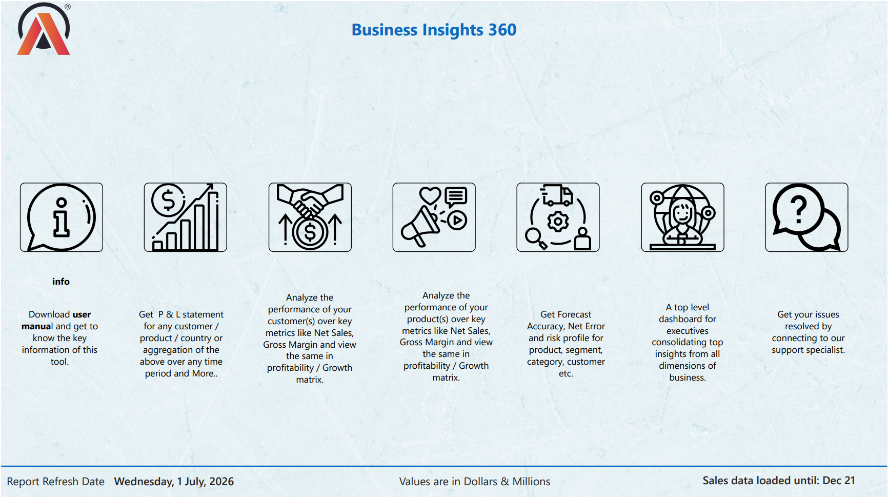
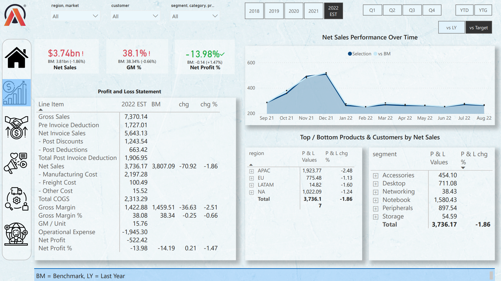
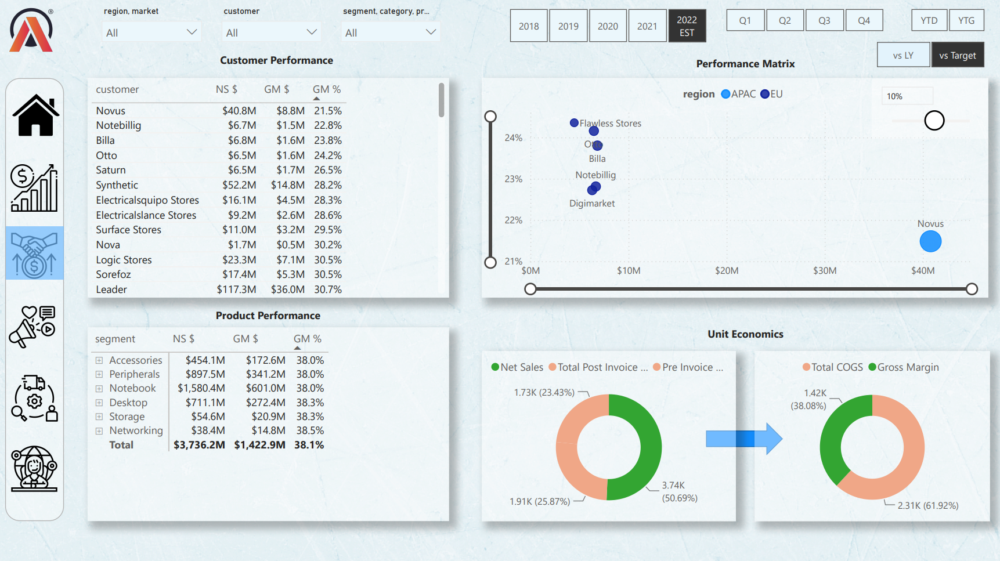
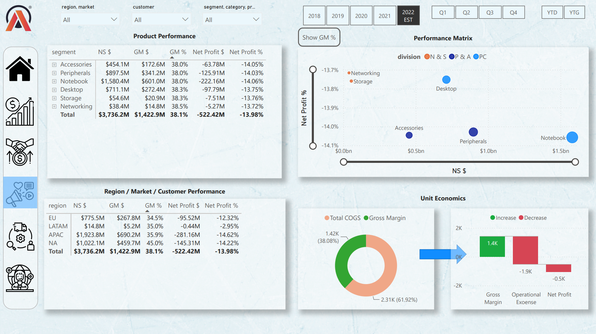
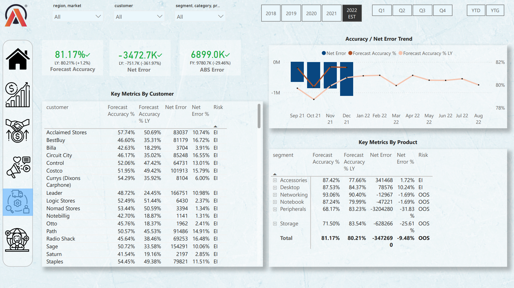
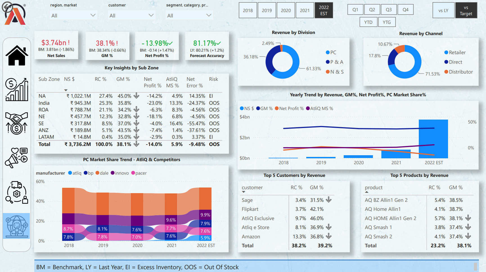
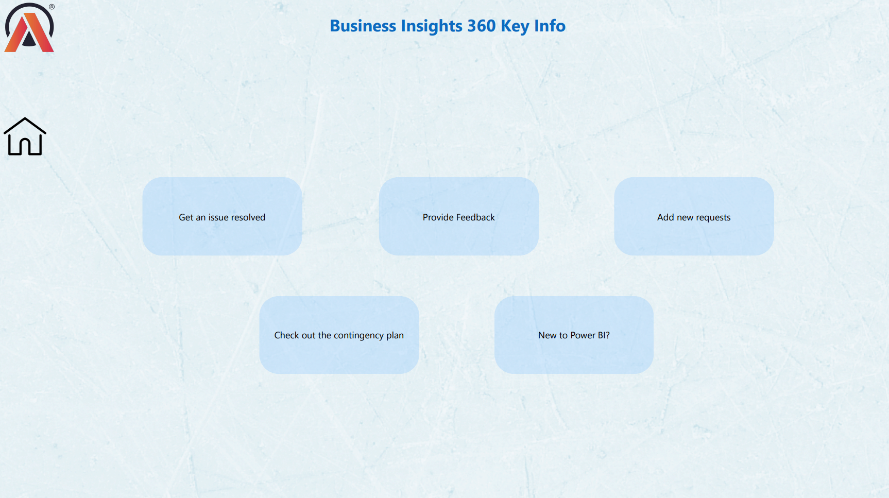

# 📊 Business Insights 360

An end-to-end **Power BI Dashboard** developed using the **AtliQ Hardware** dataset to deliver actionable insights across **Finance, Sales, Marketing, Supply Chain, and Executive** business functions.

The dashboard enables stakeholders to monitor KPIs, evaluate business performance, identify growth opportunities, and make data-driven decisions through interactive visualizations.

---

# 🏢 Company Overview

**AtliQ Hardware** *(an imaginary company)* is a rapidly growing **consumer electronics** company specializing in hardware products such as **PC accessories, printers, and peripheral devices**. Over the years, AtliQ has expanded its operations globally, establishing a strong presence across key markets, including **APAC, North America, Latin America, and the European Union**.

The company distributes its products through two primary sales platforms:

- 🏬 **Brick-and-Mortar Stores** – Partnering with leading physical retail chains such as **Croma** and **Best Buy**.
- 🛒 **E-Commerce Platforms** – Selling products through major online marketplaces such as **Amazon** and **Flipkart**.

AtliQ operates through multiple sales channels:

- 🛍️ **Retailers** – Third-party online and offline sellers that stock and sell AtliQ products.
- 🏪 **Direct Stores** – Company-owned stores where customers can purchase products directly.
- 🚚 **Distributors** – In restricted markets such as **China** and **South Korea**, AtliQ partners with authorized distributors to ensure product availability.

> **Note:** AtliQ's direct customers are **retailers** and **distributors**, while the **end consumers** are the final users of its products.

---

# 🔎 Problem Statement

As a rapidly growing company, **AtliQ Hardware** relied heavily on scattered **Microsoft Excel** files for business reporting and analytics. This fragmented approach made it difficult to generate timely insights, leading to slower decision-making and operational inefficiencies. During its expansion into the **Latin American** market, these limitations contributed to significant business challenges and financial losses.

Meanwhile, competitors leveraging modern **data analytics** and **Business Intelligence (BI)** solutions gained a competitive advantage by making faster, data-driven decisions.

To improve visibility, streamline reporting, and support strategic decision-making, AtliQ Hardware initiated a comprehensive **Business Insights 360** analytics project. The objective was to build an interactive Power BI dashboard that provides stakeholders with a centralized view of business performance across **Finance, Sales, Marketing, Supply Chain, and Executive** functions, enabling informed decisions and sustainable business growth.

---

# 🎯 Project Objective

The objective of this project is to empower business stakeholders with an interactive dashboard that enables data-driven decision-making by tracking key performance indicators (KPIs), analyzing profitability, monitoring sales performance, optimizing supply chain operations, and identifying business growth opportunities.

---

# 🛢️ Data Overview

AtliQ Hardware has provided **two SQL databases** and **three Excel files** for analysis.

## 📄 Excel Files

- **Operating Expenses**
- **Targets** *(available only for FY 2022)*
- **Market Share** *(limited to the Personal Computer division)*

## 🗄️ SQL Databases

### **gdb041**

**Fact Tables**
- `fact_forecast_monthly`
- `fact_sales_monthly`

**Dimension Tables**
- `dim_customer`
- `dim_market`
- `dim_product`

### **gdb056**

Contains the following tables:

- `freight_cost`
- `gross_price`
- `manufacturing_cost`
- `post_invoice_deductions`
- `pre_invoice_deductions`

## 📅 Fiscal Year

AtliQ's fiscal year runs from **September to August**, and the dataset covers actual sales from **September 1, 2017** to **December 31, 2021**.

> **Note:** Since this is a bootcamp project provided by **Codebasics**, the original datasets cannot be shared publicly.

---

# 🧹 Data Cleaning & Transformation

## 📌 Standardized & Trimmed Data

- Removed leading and trailing spaces from text fields.
- Standardized naming conventions to ensure consistency across the dataset.

## 📌 Data Structuring & Optimization

- Created a **`dim_date`** table to enable efficient time-based analysis.
- Merged **`fact_sales_monthly`** and **`fact_forecast_monthly`** into a single table, **`fact_actual_estimates`**, to simplify calculations and reporting.
- Added calculated fields to **`fact_actual_estimates`** by retrieving data from related tables (for example, deriving **pre-invoice deductions** using percentage values from the **`pre_invoice_deductions`** table).
- Disabled data load for intermediate tables that were only used to derive calculations in **`fact_actual_estimates`**, improving report performance and reducing the overall Power BI file size.

**Techniques Used:** Power Query, Merge Queries, Data Modeling, Calculated Columns, Performance Optimization.

---

# 📑 Report Inclusions

This repository includes a PDF version of the Power BI report hosted on the Power BI Service, along with its underlying data model. Below, you'll find a screenshot of the data model and a PDF of the report for a quick preview.

### 📄 [Dashboard](Dashboard/Business_Insights_360.pdf)

### 🧩 [Data Model](Model/Data_Model.png)

> **NOTE:** The **Information Panel** includes provisions for FAQs and a downloadable live Excel version for future company use. However, sharing the live Excel version requires the company's permission.

> **NOTE:** The **Support Panel** provides options to resolve issues, submit feedback, request new features, and review the contingency plan. Company support is required to integrate these features into the Power BI report.

---

# 🛠️ Tech Stack

- Microsoft Power BI
- Power Query
- DAX (Data Analysis Expressions)
- SQL
- Microsoft Excel
- Data Modeling
- Data Visualization

---

# 📂 Dataset

**Domain:** Consumer Electronics

**Company:** AtliQ Hardware

The project integrates Finance, Sales, Marketing, Customer, Product, and Supply Chain datasets into a centralized analytical dashboard.

---

# 📌 Key KPIs

- 💰 Net Sales
- 📈 Gross Margin %
- 💵 Net Profit %
- 🎯 Forecast Accuracy (FCA%)
- 📦 Net Error
- 🌍 Market Share
- 👥 Customer Performance
- 📊 Product Performance

---

# 📊 Dashboard Views

- 🏠 Home View
- 💰 Finance View
- 📈 Sales View
- 📢 Marketing View
- 🚚 Supply Chain View
- 👔 Executive View
- ℹ️ Info Page

---

# 📷 Dashboard Preview

## 🏠 Home View

---

## 💰 Finance View

---

## 📈 Sales View

---

## 📢 Marketing View

---

## 🚚 Supply Chain View

---

## 👔 Executive View

---

## ℹ️ Info Page

---
